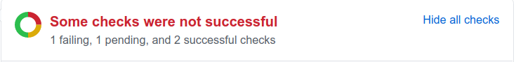

# Change Anubis

Anubis is a bot that automatically merges ready GitHub pull requests,
freeing developers from constantly syncing their pending changes with
the target branch and/or merging untested code. Anubis is a node.js
script and a GitHub webhook.

Upon startup and when the configured GitHub repository changes, the bot
finds pull requests that are ready for merging, triggers CI tests of the
staged-for-merging code, and eventually merges successfully tested
changes. Eligible pull requests are merged in the ascending PR number
order. Pull request eligibility and merging steps are detailed further
below.


## Terminology

* _Merging_: Merging a pull request involves many steps, including
  automated CI tests, PR labeling, and the target branch update. Do not
  confuse this general/imprecise term with the atomic action of merging
  one git branch into another.

* _Core developer_: From the bot point of view, a core developer is a
  GitHub user with write access to the configured repository (`config::repo`).


## Which pull requests are eligible for merging?

A pull request is ready for merging if all of the following conditions
are satisfied:

* The PR is open. GitHub shows a green "Open" icon below the PR title.
* The PR does not have conflicts with its target branch. GitHub does
  _not_ show "This branch has conflicts that must be resolved" text in
  the PR summary status box at the bottom of an open PR page. The exact
  text displayed by GitHub for these so called "mergeable" PRs varies
  depending on whether the changes are approved and whether the PR
  branch is out of date with its target branch.
* The PR is not a
  [draft](https://docs.github.com/en/github/collaborating-with-pull-requests/proposing-changes-to-your-work-with-pull-requests/changing-the-stage-of-a-pull-request).
* All the _required_ checks have succeeded on the PR branch:
  * If _all_ checks have succeeded, then GitHub says "All checks have
    passed" next to a green check mark:
    
  * If any _optional_ checks have failed, then GitHub will show "Some
    checks were not successful" message:
    
  
    Unfortunately, GitHub also displays the above message when some
    required checks have failed. To determine whether all the required
    checks have succeeded when some checks have failed, expand the check
    list using the "show all checks" link.
* The PR is approved for merging (see below for voting rules).
* The PR has a valid title and description (see below for commit message rules).
* The PR does _not_ have an `M-merged` label.

Satisfying the above conditions results in an attempt to merge the pull
request (in the ascending PR number order), but merging may still fail.


## Pull request merging algorithm

Each eligible pull request is processed according to the following
algorithm:

1. [Create](https://developer.github.com/v3/git/commits/#create-a-commit
   ) a new "staging commit" with the following components:
   * `tree`: The git tree object of the PR
     [merge commit](https://developer.github.com/v3/pulls/#get-a-single-pull-request)
     created by GitHub.
   * `parents`: The HEAD commit of the PR base branch.
   * `message`: PR title (with an appended PR number) plus the PR
     description.
   * `author`: The PR author object (containing login and email) of the
     PR merge commit.
   Note that the individual commits (including their messages) on the PR
   branch are ignored. The bot is effectively performing a squash merge
   using a GitHub-editable commit message.
2. Reset the staging (a.k.a. "auto") branch to the PR staging commit.
   The previous state of the staging branch is ignored.
3. Wait for GitHub to report exactly `config::staging_checks` CI test
   results for the staging branch. The project CI infrastructure is
   expected to auto-test the staging branch on every change. A check
   failure is a PR-specific step failure -- in GitHub terminology, all
   staging checks are currently deemed "required". If discovered, any
   extra check is considered a configuration problem (not related to any
   specific PR). Error handling is detailed in the next section.
4. Fast forward the PR target branch (usually "master") to the
   now-tested staging commit.
5. Label the PR as merged (see below for PR labels) and close the PR.

If the bot is killed while executing the above algorithm, it will resume
from the beginning of the unfinished step.

While the bot is merging a pull request, it does not touch other PRs. If
the bot receives a GitHub event while merging a pull request, then the
bot re-examines all PRs _after_ it is done merging the current PR. This
approach simplifies repository state (multiple PRs in various
intermediate merging steps would easily confuse humans and may overwhelm
CI) while still allowing the lowest-numbered PR to be merged first
(among the then-ready PRs).


## Error handling

A bot that cannot parse its configuration quits.

When encountering PR-unrelated problems (e.g., network I/O timeouts or
internal GitHub server errors), the bot sleeps for 10 minutes
(hard-coded) and then effectively restarts. Only the already parsed
configuration is preserved across such restarts.

If a PR processing step fails for PR-specific reasons (e.g., a CI test
failure), then the bot moves on to the next pull request, labeling the
failed PR if/as needed (see below for PR labels).


## Pull request labels

The bot uses the following custom GitHub labels to mark the current pull
request state:

* `M-waiting-approvals`: The PR approval rules (see "Voting and PR
  approvals" below) do not allow the bot to start merging regardless of
  how old the PR gets. Compare with `M-waiting-objections`. The bot
  removes this label when it notices that it is obsolete. TODO:
  Implement.
* `M-waiting-objections`: The PR approval rules (see "Voting and PR
  approvals" below) allow the bot to start merging when the PR gets
  older. The bot will eventually start merging this PR if no objections
  are received while the bot is waiting. The wait time is determined by
  the number of votes already received. The bot removes this label when
  it notices that it is obsolete. TODO: Implement.
* `M-waiting-staging-checks`: The bot determined that the PR is eligible
  for merging, successfully completed the initial merging steps that are
  supposed to trigger CI tests, and is now waiting for the CI test
  results. The bot removes this label when it notices that all
  `config::staging_checks` tests have completed.
* `M-passed-staging-checks`: Similar to the GitHub "green check" mark
  for the staging branch commit (but ignores failures of optional
  checks). Usually only visible when the bot is running in staging-only
  mode (see `config::staged_run` and `config::guarded_run`). The bot
  removes this label when either the PR was successfully merged or its
  staging results are no longer fresh/applicable.
* `M-abandoned-staging-checks`: Anubis discovered a stale _staging commit_.
  This usually happens when either the PR state changes (e.g., the author
  commits new code) or the staging_branch is unexpectedly modified. After
  labeling the PR, the bot ignores any failed or unfinished tests associated
  with that stale commit. This label was added so that the developer observing
  the PR page on GitHub knows why Anubis ignored (failed, unfinished, or
  successful) staging tests. The bot removes this (usually short-lived) label
  after creating a fresh staging commit for the PR.
* `M-failed-staging-checks`: Essentially duplicates GitHub "red x" mark for
  the _staging commit_. The bot does not attempt to merge this PR until the
  previously failed checks for the staging commit are abandoned (see
  `M-abandoned-staging-checks`) or are restarted and finish successfully.
* `M-failed-staging-other`: A fatal PR-specific error that occurred while
  waiting for staging checks but was not classified as
  `M-failed-staging-checks`. It is probably necessary to consult CI logs to
  determine what happened.  The bot does not attempt to merge this PR again
  until a human decides that this problem is resolved and removes the label
  manually.
* `M-failed-description`: The PR title and/or description is invalid
  (see below for PR commit message rules). The bot removes this label
  when it revisits the PR and notices that the commit message components
  were fixed.
* `M-failed-other`: All other fatal PR-specific errors. It is probably
  necessary to consult CI logs to determine what happened. Anubis will process
  the labeled PR again, optimistically assuming that the problems are
  resolved. The bot removes the label if the problems are indeed gone.
* `M-cleared-for-merge`: A human has allowed the bot running in
  `config::guarded_run` mode to perform the final merging step --
  updating the target branch. The label has no effect unless the bot is
  running in that mode. This is the only bot-related label that is meant
  to be set by humans; the bot itself never sets this label. The bot
  removes this label after successfully merging the PR. Avoid setting
  this label unless you are a human responsible for testing the bot.
* `M-merged`: The PR was successfully merged (and probably closed).
  The bot will not attempt to merge this PR again even if it is
  reopened. The bot never removes this label.

All labels except `M-failed-staging-checks`, `M-failed-staging-other`,
`M-cleared-for-merge`, and `M-merged` are ignored by Anubis! Humans may find
them useful when determining the current state of a PR.


## Commit message

The staging commit message and, hence, the target branch commit is
formed by concatenating the PR title (with an appended PR number), an
empty line and the PR description.

Neither the title nor the description are currently processed to convert
GitHub markdown to plain text. However, both texts must conform to the
72 characters/line limit. The automatically added ` #(NNN)` title suffix
further reduces the maximum PR title length to ~65 characters. PRs violating
these limits are labeled `M-failed-description` and are not merged.


## Voting and PR approvals

The following events disqualify a pull request from automatic merging. A
single event is sufficient for PR disqualification:

* A negative GitHub vote by a core developer.
* A GitHub review request naming a core developer.

A PR without disqualifications is considered approved for merging if
either of the following two conditions is met:

* Fast track: A PR has at least two approvals
  (`config::sufficient_approvals`) by core developers and has been open
  for at least 48 hours (`config::voting_delay_min`). The delay gives
  all core developers a better chance to review the pull request before
  it gets merged while still supporting a decent development pace.

* Slow burner: A PR has at least one approval
  (`config::necessary_approvals`) by a core developer and has been open
  for at least 10 calendar days (`config::voting_delay_max`). The wait
  limit allows for eventual automated merging of pull requests that
  failed to attract a lot of attention while still properly vetting the
  changes.

The bot uses two sources of information when counting approvals:

* GitHub review votes.

* PR authorship: The PR author is assumed to approve PR code. The bot
  uses this assumption because GitHub does not allow PR authors to vote,
  needlessly slowing down PR acceptance.

Allowing a developer to submit a PR without implicitly approving it is a
missing feature. This feature is especially useful when a core developer
submits 3rd-party code that they did not have a chance to properly
review.

Votes by users other than core developers are currently _not_ counted.
Properly counting such votes is a missing feature.


## Bot lifecycle

The bot may be started like any node.js script. For example:

```
node ./src/Main.js /etc/anubis/config.json
```

The bot can be safely killed and started at any time because it uses the
public/remote GitHub repository to store PR processing state. The bot
does not clone the repository.


## Configuration

The bot is a GitHub [webhook](https://developer.github.com/webhooks/)
(i.e., an HTTP server expecting requests from GitHub).

### GitHub configuration

To configure your GitHub repository to notify the bot, go to
Settings/Webhooks and click the "Add webhook" button. The corresponding
dialog has the following options:

* The "payload URL" is comprised of the "http" scheme, the host name or
  IP address of the server hosting the bot, bot port (`config::port`),
  and bot URL path (`config::github_webhook_path`) values.
* The "Content type" field should be `application/json`.
* The "secret" field should be a random string of characters matching
  bot `config::github_webhook_secret`.
* The bot needs to receive `Pull request review`, `Push`, `Pull
  request`, and `Status` events.


### Bot configuration

The bot loads its configuration from the configuration file named as the
first command-line parameter (or `./config.json` by default). You may
use `config-example.json` to bootstrap your configuration.

All configuration fields are required.

*Field* | *Description* | *Example*
--- | --- | ---
*github_login* | The bot uses this GitHub user account for all GitHub communications, including target branch updates. This user needs to have write access to the repository.| "squid-anubis"
*github_token* | An authentication token generated for the associated `config::github_login`. | "425a..."
*github_webhook_path* | GitHub webhook URL path. | "/anubis"
*github_webhook_secret* | A random secret string to be used here and in the GitHub webhook configuration. | "72fe..."
*host* | The bot listens for GitHub requests on this IP address. Given an empty string, the bot listens on all available IP interfaces. | ""
*port* | The bot listens for GitHub requests on this TCP port. | 7777
*repo* | The name of the GitHub repository that the bot should serve. | "squid"
*owner* | The owner (a person or organization) of the GitHub repository. | "squid-cache"
*dry_run*| A boolean option to enable read-only, no-modifications mode where the bot logs pull requests selected for merging but skips further merging steps, including PR labeling | false
*staged_run*| A boolean option to enable staging-only mode where the bot performs all the merging steps up to (but not including) the target branch update. Eligible PRs are merged into and tested on the staging branch but are never merged into their target branches. Staging-only mode prevents any target branch modifications by the bot. TODO: Check that the PR target branch is not the configured staging branch, setting `M-failed-other` if needed. | false
*guarded_run*| Enables staging-only mode (see `config::staged_run`) for PRs without a `M-cleared-for-merge` label. Has no effect on PRs with that label. While `config::staged_run` blocks target branch modifications, this option allows them for a human-designated subset of PRs. | false
*staging_branch* | The name of the bot-maintained git branch used for testing PR changes as if they were merged into their target branch. | auto
*necessary_approvals* | The minimal number of core developers required for a PR to be merged. PRs with fewer votes are not merged, regardless of their age. | 1
*sufficient_approvals* | The minimal number of core developers required for a PR to be merged fast (i.e., without waiting for `config::voting_delay_max`) | 2
*core_developers* | The comma-separated list of login=id pairs representing GitHub core developers. | ""
*voting_delay_min*| The minimum merging age of a PR. Younger PRs are not merged, regardless of the number of votes. The PR age string should comply with [timestring](https://github.com/mike182uk/timestring) parser. | "2d"
*voting_delay_max* | The maximum merging age of a PR that has fewer than `config::sufficient_approvals` votes. The PR age string should comply with [timestring](https://github.com/mike182uk/timestring) parser. | "10d"
*staging_checks*| The expected number of CI tests executed against the staging branch. | 2
*approval_url*| The URL associated with an approval status test description. | ""
*logger_params* | A JSON-formatted parameter list for the [Bunyan](https://github.com/trentm/node-bunyan) logging library [constructor](https://github.com/trentm/node-bunyan#constructor-api). | <pre>{<br>    "name": "anubis",<br>    "streams": [ ... ]<br>}</pre>

TODO: Merge all three "mutually exclusive" boolean `*_run` options into one `run_mode` option accepting on of four mode names, including "production". Document individual string values in a separate table (here).


## Caveats

### Merging eligibility may change while merging

The bot checks merge eligibility conditions when starting to process a
given pull request. It is possible that a checked condition changes
during or after that initial check. There is no guarantee that the bot
will notice such "late" changes. Similar race conditions exist for
manual PR merging, of course.


### GitHub does not know that a PR was merged

GitHub does not recognize auto-merged PRs as merged -- it shows the
following message instead of the purple "Merged" icon:


Even with a single-commit PR, the merged commit has a different commit
message (and often different code!) than the PR branch commit. When
squash-merge or rebase-merge commits are used, the differences between
the merged commit SHA and the PR branch SHA prevent GitHub from
recognizing that the PR was effectively merged. GitHub itself provides
Squash Merge and Rebase Merge buttons that do not lose merge
information, but GitHub probably uses some GitHub-specific information
to track such merged PRs. We failed to find an API to tell GitHub that a
PR is effectively merged.

TODO: Ask GitHub support for help or request an API enhancement.


## Background

### Origins

Anubis originated from a simple
[EggTimer](https://github.com/dgmltn/EggTimer) bot when the [Squid
Project](http://www.squid-cache.org/) needed to automate pull request
merging. We eventually realized that the two bots address different
needs and deserve to live their separate lives. Almost no original
EggTimer code survived the massive changes, and all Anubis bugs are
exclusively ours. Special thanks to the EggTimer author for sharing
his bot and unwittingly providing us with an excellent bootstrapping
tool!

### Naming

Our bot is named after the Egyptian god [Anubis](https://en.wikipedia.org/wiki/Anubis) because of the striking similarities between the bot and the famous psychopomp roles:

* The bot is a protector of the ~~tombs~~ official project branches.
* The bot escorts developer code to the ~~afterlife~~ master branch.
* The bot ~~embalms~~ stages pull request code for CI tests.
* The bot ~~weighs the heart~~ judges merge worthiness of the pull request.

### Relatives

Other merge bots include [Bors](https://github.com/bors-ng/bors-ng), [Homu](https://github.com/servo/homu), [mergebot](https://github.com/calmh/mergebot), and [EggTimer](https://github.com/dgmltn/EggTimer).
